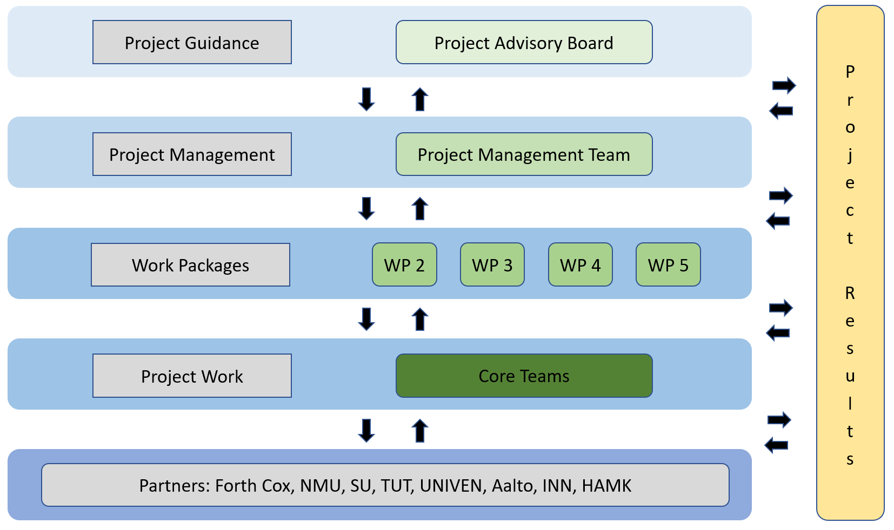

# Introduction

## About FOREST21

FOREST21 is a joint project for strengthening capacity in South African higher education in forestry. The project is implemented in collaboration of five higher education institutions (HEIs) in South Africa that have forestry curricula or will start teaching forestry.

Promoting climate-smart forestry and entrepreneurial innovativeness in forestry education will lead to job creation as well as mitigation of climate change. FOREST21 is implemented through reforming the curricula in forestry entrepreneurship education to equip graduates with problem-solving skills, an entrepreneurial mindset and climate-smart thinking.

Problem-based learning (PBL) methods and students-centred teaching are in the centre of the project. Students learn through solving real-life business challenges on the field in international teams. FOREST21 requires close collaboration with the industrial sector as well as teachers and the managerial staff in partner HEIs to find the practices in the local context.

## Project Description

In South Africa, the forestry sector is increasingly seen as a critical sector for (i) livelihood development, given the simultaneous youth population bulge and high unemployment rates, as well as for (ii) the addressing of global sustainability challenges, given the potential of forestry to advance South Africa's National Climate Change Adaptation Plan (2018). Given this dual importance, Higher Education Institutions (HEIs) should naturally take a lead in preparing graduates to create sustainability-aligned economic opportunities. Yet, forestry HEIs in South Africa have constrained capacity to prepare graduates for post-school careers. These shortcomings exist for sector-specific knowledge on sustainable forestry practices, as well as for the entrepreneurial skills needed to leverage forestry opportunities. Given the importance of addressing these shortcomings, this project will involve collaboration between Finnish, Norwegian, and South African HEIs to develop the forestry-related curricula of South African HEIs, so that graduates are holistically equipped to sustainably leverage forestry for livelihood development.

The project will address:

-   Increasing levels of unemployment in South Africa.

    According to Statistics SA, South Africa experiences around 32.5% unemployment rate [@statssa2021]. Youth are the most vulnerable in the South African labour market, with even university graduates in this age group having an unemployment rate of 31.0%. Forestry-related entrepreneurship can provide a partial solution to this problem, as young people have enormous potential for innovation and risk-taking, which can produce start-ups employing many people. To fully realize these opportunities embedded in forestry, HEIs should use their curricula to produce inquisitive graduates who can think in new ways, and who have the courage to meet and adapt to the challenges facing them an entrepreneurial mindset that is simultaneously mindful of sustainability.

-   Foresters mitigating climate change.

    Forests are critical for global ecosystems and carbon balances, especially because of their potential to sequester carbon in forests. In its 2009 Forest Sector Charter, South Africa officially recognized its massive potential to sequester carbon through new afforestation of about 100 000 hectares (Forest Strategy 2009-2030). Yet, this potential has not been exploited, sustainability has not entered the mainstream of South African Forestry, and forestry graduates have not internalized the importance, benefits, and necessity of integrating sustainability into forestry. To address this shortcoming, climate-smart forestry will seek new ways of producing, using, and repurposing traditional forestry products like wood products, pulp, paperboard, and paper. This will include teaching forestry students the principles of the circular economy, of sustainable forestry management, and the potential of new innovative wood-based bioproducts. The overarching goal will be to not just lower the environmental impact of current forestry practices, but to leverage forestry management to increase the sequestration of carbon.

-   Foresters of 21st century, education shortcomings, and new teaching methods

    There is substantial discrepancy between what the forestry industry in South Africa sees as the key skills for future foresters, and what is being taught in HEIs offering forestry. Several research papers highlight this [@mgagaDoesTertiaryEducation2019; @längin2008]. The higher education thus needs innovative approaches to develop 21st century foresters. To do this, South African HEIs will embrace teaching methods that not only improve information retention, but also allow students to learn how to solve real work problems. FOREST21 aims to assist a paradigm shift from teacher-centered knowledge sharing to the model where student create knowledge together for themselves (knowledge co-creation through discovery). In parallel, forestry HEIs will increase their curricula offerings on climate adaptation, and mainstream climate issues in core courses. Furthermore, HEIs need to recognize that they can serve as regional/local hubs for communities and business actors for creating, testing and disseminating knowledge and adaptation strategies.

-   Developing Entrepreneurial Mindsets

    21st century foresters need more than just forestry knowledge. Indeed, to leverage this knowledge effectively, they need an entrepreneurial mindset. This mindset will allow HEI graduates to identify, develop, exploit, and grow sustainability-related forestry opportunities, either through starting new ventures or through "intrapreneurship" in existing ventures. However, South African HEI's currently do little to develop these mindsets. As such, this project will work to develop entrepreneurial skills such as business plan development, while also focusing on the "softer" side of entrepreneurship so that graduates see entrepreneurship as a viable and beneficial employment pathway.

-   Forestry HEIs working together

    South African universities offering forestry currently do not work together. The mentality of working in silos has for a long-time been discouraged by industry government, but no change has been seen because there has not been a real opportunity for the HEIs to work together. Moreover, industry partners have sporadic cooperation with HEIs.

    However, this project will provide an opportunity for all forestry companies to work with all forestry HEIs. FOREST21 in unique as all existing, and two future, forestry HEIs are part of the consortia. Also, key stakeholders and governmental actors have committed to the project to create a framework for an impactful delivery.

### Target Groups

All partner HEIs have similar direct and indirect target groups with similar needs; thus target group identification and their needs analysis are presented jointly for all the Partner HEIs. The direct target groups: (i) students needing real-world relevant education, and (ii) HEIs needing to have the competence to deliver this.

-   The current **forestry graduates** are not equipped with skills and competencies to perform as expected in the world of work. This is one reason for the high unemployment of graduates. In addition, because the entrepreneurship curricula do not give entrepreneurial skills, graduates do not start businesses of their own. This means that forestry-sector potential is not utilized in societal development. Further, climate change and environmental challenges put pressure on forestry graduates' competences; they are to understand and to act through forestry for sustainability. Forestry21 aims to tackle the issue of curricula content and implementation relevancy in three of the Partner HEIs who will upgrade the current courses and in the two Partner HEIs will open new BSc forestry courses.

-   **Partner HEIs** have recognised the capacity gaps in curricula content and delivery methodology in their work to produce sustainable learning outcomes to support wealth creation and environmental sustainability. In South Africa, there are only random short courses on professional pedagogics available, and teachers have not been able to benefit training on how to plan and deliver curricula in a sustainable way. Forestry is the key leverage point for environmental sustainability and therefore needs to be integrated into the new and upgraded curricula.

-   **The university-industry partnership** is weak in all partner HEIs. To equip the graduates with work-life relevant skills and competences requires companies and NGOs/CBOs to be part of the learning ecosystem. Cooperation practises needs to be jointly developed and tested and after that institutionalized. Education governance needs good practises and research-based understanding on sustainable teaching and learning for the HEI quality enhancement.

### Expected Project Outcome

-   **Work-life responsive Climate Smart Forestry Curricula:** The curricula content is to meet the expectations of the world of work: students to be equipped with domain and metacognitive knowledge and skills to be attractive for employers, thus to be able to fulfil their respective mandates when employed. For this, graduates need (i) entrepreneurial mindset and practical entrepreneur competence which would even encourage them to establish businesses of their ow and (ii) comprehensive competencies for climate change mitigation through forestry.

-   **Skills development:** The partner HEI entrepreneurship curricula are concentrating on the knowledge component of competence, and the two other competence components - skills, and attitude development are both ignored. For entrepreneurial mindset building and expertise in environmental protection, skills development is crucial. The fundamental principle of competence is that competence only exists when all three parts of competence (knowing-doing-being) are present. The knowledge component is the easiest one to develop, and the skills development, where the learner applies the theory into practice, is the most challenging one. The being domain (attitude) naturally follows the skills component development; when being able to do, one develops self-confidence, the trust in him/herself and the right attitude to the work

-   **Authentic learning environment:** The skills development is not possible without real-life experiences. The authentic learning environment is critical for internalizing both climate-smart forestry and sustainability. The collaborative learning ecosystem where forestry community, industry and communities are part of the learning and teaching process, is a motivating and transformative way of learning. In challenge-driven learning, students are invited to read and analyse the problem scenario, absorb and analyse information, work in teams to use creativeness and innovation, develop possible actions and present the findings. In this self-directive learning process, students take responsibility for their own learning and the teacher serves as a resource to the student teams. The skills development increases students' competitiveness in the world of work and relevance to the labour market. Also, it develops students' domain-specific knowledge and their understanding of their professional identity. For the challenge-owners the collaborative learning ecosystem brings benefits as well; at its best, they get innovative and creative solutions and in every case, they get new members to their community of practice.

-   **21st-century skills:** Students of today are preparing themselves to the world of work which is constantly changing and different tomorrow than today. The domain-specific knowledge is not enough for the graduates to be qualified to meet the requirement of the future world of work. 21st-century skills emphasise critical thinking & problem solving, innovativeness & creativeness and teamwork & communication, leadership skills, self-directiveness, cross-cultural and diversity competences, lifelong learning skills and high work ethics. All of these are topics the curricula must contain. The collaborative skills development process with real-life cases contributes to developing all these metacognitive competences of future professionals.

### Wider Objective

Despite the huge potential, South Africa (SA) is having challenges to create forestry-based jobs and wealth. At the same time strong forestry expertise is needed to fulfill the national climate change/carbon commitments. One very critical reason for the forestry-sector not meeting its expectations in societal and environmental development is that the skills and competences of HEI forestry-graduates do not match the requirements of the world of work. Changing this situation requires:

-   Cooperation between academia and societal/industry partners

-   A new approach in HEIs for producing the new and critical competencies

-   HEIs to be equipped with 21st century forestry competences

The wider objective for FOREST21 is thus defined as:

```{=tex}
\begin{tcolorbox}

\textsc{Strengthening South African forestry HEIs capacity to provide work-life relevant and inclusive higher education for societal and environmental development.}

\end{tcolorbox}
```

```{r widerobj, echo = FALSE}

library(flextable)
library(magrittr)

set_flextable_defaults(fonts_ignore=TRUE) 

widerobj <- data.frame(Indicators = c("Increased role of HEIs in climate change dialogue, innovation and societal impact", "Recognized expert role of teachers", "Improved employment and widened career opportunities of graduates"),                                
                         Measurement = c("Public and private resources", "Diversified career opportunities for recognized expert teachers", "Publicity (interviews, presentations, expert opinions) \n Employment statistics"))

widerobj <- flextable(widerobj)
widerobj <- set_caption(widerobj, "Wider Objective")

widerobj <- height(widerobj, height = .3) %>% 
  hrule(rule = "exact", part = "body")  
                       
widerobj %>%  
  theme_vanilla() %>% # evt theme_zebra
  width(j=~Indicators,width=3.5) %>% 
  width(j=~Measurement,width=3.5) %>%
  bg(bg = "#ADDFAD", part = "header")
  
```

### Specific Objectives

```{=tex}
\begin{tcolorbox}

\textsc{Objective 1: Utilization of new climate smart forestry curricula with incorporation of entrepreneurial skills and metacognitive competences.}

\end{tcolorbox}
```


```{r specobj1, echo = FALSE}

library(flextable)
library(magrittr)

set_flextable_defaults(fonts_ignore=TRUE) 

specobj1 <- data.frame(Indicators = c("Number of new/updated courses integrated in partner universities \n \n Number of teachers and faculty trained in climate smart forestry courses \n \n Increased knowledge of teachers on climate-smart forestry \n \n Student satisfaction on courses"),                                
                       Measurement = c("Project progress reports \n \n Workshop statistics \n \n Self-assessments \n \n Student feedback reports"),
                       Risks = c("Commitment from university leadership and policy makers \n \n Interest and motivation of teachers and faculty \n \n Students active participation"),
                       Mitigation = c("Open, incl face-to-face, communication and actively involving \n HEIs management and academic leaders \n Teachers and faculty staff \n Students"))

specobj1 <- flextable(specobj1)
specobj1 <- set_caption(specobj1, "Specific Objective 1")

specobj1 <- height(specobj1, height = .3) %>% 
  hrule(rule = "exact", part = "body")  
                       
specobj1 %>%  
  theme_vanilla() %>% # evt theme_zebra
  width(j=~Indicators,width=1.68) %>% 
  width(j=~Measurement,width=1.68) %>%
  width(j=~Risks,width=1.68) %>%
  width(j=~Mitigation,width=1.68) %>%
  bg(bg = "#ADDFAD", part = "header")
```

```{=tex}
\begin{tcolorbox}

\textsc{Objective 2: Improved student-centered teaching and learning methods by introducing problem-based learning.}

\end{tcolorbox}
```


```{r specobj2, echo = FALSE}

library(flextable)
library(magrittr)

set_flextable_defaults(fonts_ignore=TRUE) 

specobj2 <- data.frame(Indicators = c("Number of teachers /faculty staff trained in PBL methodology \n \n Number of students trained following PBL methods \n \n Increased pedagogical practices of teachers/faculty staff \n \n Graduates increased innovation and problem-solving skills \n \n New training materials developed"),                                
                       Measurement = c("Lists of training participants \n \n Course statistics \n \n Staff capacity assessment reports \n \n Student feedback reports \n \n Course performance evaluation \n \n Printed and digital teaching materials \n \n Case study reports and feedback from case-owners"),
                       Risks = c("Personal engagement and motivation of teachers/faculty staff \n \n Change of staff during the project \n \n Students readiness and motivation for new learning practices \n \n Delays in production of PBL training materials \n \n Commitment and active involvement of societal/industry partners"),
                       Mitigation = c("Guidance and support from project management and associate partners \n \n Support and guidance to teachers/faculty staff in the transformation processes \n \n Sharing information for institutionalizing new competences and practices \n \n Mentoring and coaching of students \n \n Active quality management"))

specobj2 <- flextable(specobj2)
specobj2 <- set_caption(specobj2, "Specific Objective 2")

specobj2 <- height(specobj2, height = .3) %>% 
  hrule(rule = "exact", part = "body")  
                       
specobj2 %>%  
  theme_vanilla() %>% # evt theme_zebra
  width(j=~Indicators,width=1.68) %>% 
  width(j=~Measurement,width=1.68) %>%
  width(j=~Risks,width=1.68) %>%
  width(j=~Mitigation,width=1.68) %>%
  bg(bg = "#ADDFAD", part = "header")

```

```{=tex}
\begin{tcolorbox}

\textsc{Objective 3: Actively cooperating network-based learning ecosystem with academia and societal/industry partners in South African context.}

\end{tcolorbox}
```


```{r specobj3, echo = FALSE}

library(flextable)
library(magrittr)

set_flextable_defaults(fonts_ignore=TRUE) 

specobj3 <- data.frame(Indicators = c("Number of collaboratively implemented field challenges \n \n Number of collaborating partnerships \n \n Feedback from the partners on the relevance of the cooperation \n \n Feedback from education policy authorities"),                                
                       Measurement = c("University records \n \n Discussions and reports"),
                       Risks = c("HEIs and teachers’ capacity and interest to develop expertise for industry cooperation \n \n Education authorities’ commitment to network-based learning"),
                       Mitigation = c("Active dialogue on the cooperation benefits \n \n Active dialogue with HEIs leadership, associate partners and education authorities \n \n Sharing knowledge and experiences"))

specobj3 <- flextable(specobj3)
specobj3 <- set_caption(specobj3, "Specific Objective 3")

specobj3 <- height(specobj3, height = .3) %>% 
  hrule(rule = "exact", part = "body")  
                       
specobj3 %>%  
  theme_vanilla() %>% # evt theme_zebra
  width(j=~Indicators,width=1.68) %>% 
  width(j=~Measurement,width=1.68) %>%
  width(j=~Risks,width=1.68) %>%
  width(j=~Mitigation,width=1.68) %>%
  bg(bg = "#ADDFAD", part = "header")
```

```{=tex}
\begin{tcolorbox}

\textsc{Objective 4: Strengthened HEI capacity to further contextualize and develop curricula, pedagogical methodology and learning ecosystems through national and international partnerships.}

\end{tcolorbox}
```


```{r specobj4, echo = FALSE}

library(flextable)
library(magrittr)

set_flextable_defaults(fonts_ignore=TRUE) 

specobj4 <- data.frame(Indicators = c("Forestry21 teacher network created and active \n \n Further development of curricula incorporated in HEIs strategies \n \n Mechanism established to continue collaboration within South African HEIs \n \n Number of publications and articles \n \n Cooperation mechanisms set up for national and international partnerships"),                                
                       Measurement = c("Network activity \n \n HEIs strategies and policies \n \n Experiences of teachers, faculty staff and management \n \n Publications, articles \n \n Cooperation MoUs and partnership agreements"),
                       Risks = c("Teachers commitment and limited time resources \n \n Resources for network management \n \n Continuous commitment and cooperation of HEIs, authorities and industry stakeholders"),
                       Mitigation = c("Encouraging active participation of individuals \n \n Participatory project management encourages to cooperation \n \n Dissemination of best practices"))

specobj4 <- flextable(specobj4)
specobj4 <- set_caption(specobj4, "Specific Objective 4")

specobj4 <- height(specobj4, height = .3) %>% 
  hrule(rule = "exact", part = "body")  
                       
specobj4 %>%  
  theme_vanilla() %>% # evt theme_zebra
  width(j=~Indicators,width=1.68) %>% 
  width(j=~Measurement,width=1.68) %>%
  width(j=~Risks,width=1.68) %>%
  width(j=~Mitigation,width=1.68) %>%
  bg(bg = "#ADDFAD", part = "header")
```

### Project Coordinator

### Participating Organizations

```{r participants, echo = FALSE}

library(flextable)
library(magrittr)

set_flextable_defaults(fonts_ignore=TRUE) 

participants <- data.frame(Institution = c("Fort Cox Agriculture and Forestry Training Institute", "Nelson Mandela University", "Tschwane University of Technology", "Stellenbosch University", "University of Venda", "Häme University of Applied Sciences", "Inland Norway University of Applied Sciences", "Aalto University"),                                
                         Abbr = c("Fort Cox", "NMU", "TUT", "SU", "UNIVEN", "HAMK", "INN", "Aalto"),
                         Description = c("Established in 1930, the only SA institution offering Diplomas in Forestry; visions is to be the leading center in sustainable agriculture and forestry by providing quality education and training in agriculture and forestry, by engaging to applied research and community outreach with final objective to improve livelihood in SA.", "Roots back to 1911, when the oldest forestry campus of SA was established to Tokai near Cape Town. Todau NMU, after several mergers and name changes, has a proud tradition of excellence and service to the forestry industry.", "Established in 2003 through several mergers; defines itself as a people’s university that makes knowledge work. Strategic Plan 2020-25 wants TUT learning to become a continuum of creation, innovation and technology transfer to serve the communities; to find authentic and enduring solutions to communities’ most pressing problems.", "The oldest university in South Africa; received full university status in 1918. SU wants to be research-intensive university which attracts outstanding students, employ talented staff and provide a world-class environment; a place connected to the world, while enriching and transforming local, continental and global communities.", "Opened in 1982 to cater for the then Homeland of Venda; since its establishment, the UNIVEN has experienced tremendous growth and change and to date the university has established itself as a national asset through its niche on problem oriented, project-based curriculum with a strength in nurturing under prepared students into nationally competitive graduates.", "Häme University of Applied Sciences (HAMK) is a multidisciplinary, workplace-orientated higher education institution. HAMK offers 27 Bachelor’s degree programmes, 10 Master’s degree programmes and professional teacher education. Ten of the degree programmes are taught in English.", "INN is a result of the 2017 merger of two academic institutions with long traditions. It now runs 6 campuses with a total of 16,000 students on a vast range of study programs, including 4 PhD programs.", "By merging three leading Finnish universities in 2010, Aalto was founded to work as a societally embedded research university. In a short space of time, Aalto University has since become a forerunner in our key areas. We are renowned for our sense of community and culture of entrepreneurship and innovation."))

participants <- flextable(participants)
participants <- set_caption(participants, "Participating Organizations")

participants <- height(participants, height = .3) %>% 
  hrule(rule = "exact", part = "body")  
                       
participants %>%  
  theme_vanilla() %>% # evt theme_zebra
  width(j=~Institution,width=1) %>% 
  width(j=~Abbr,width=0.6) %>%
  width(j=~Description, width = 5) %>%
  bg(bg = "#ADDFAD", part = "header")
  
```

### Associated Partners

See Appendix for associated partners.

### Project Characteristics

### Work Packages

```{r WP, echo = FALSE}

library(flextable)
library(magrittr)

set_flextable_defaults(fonts_ignore=TRUE) 

workpackages <- data.frame(WP = c("WP1",
                                  "WP2",
                                  "WP3",
                                  "WP4",
                                  "WP5"),                                
                           Lead = c("SU",
                                   "NMU",
                                   "INN",
                                   "TUT",
                                   "HAMK"),
                          Co_Lead = c("NMU",
                                      "TUT, UNIVEN, Aalto",
                                      "SU, UNIVEN, Fort Cox",
                                      "Fort Cox, SU",
                                      ""),
                          Content = c("Foundation for paradigm change FOREST21 Curricula with entrepreneurship competence                                          + soft skills integration. Creation of joint understanding PBL + Climate Smart                                           Forestry Curricula and build HEI ownership to the transformation.",
                                      "Trainings on PBL-method and contextualizing it through field-challenges; knowledge                                          creation of climate smart forestry; setting up structures for the project                                                sustainability and further methodological development.",
                                      "PAR-based quality assurance of the project implementation and management.",
                                      "Dissemination and exploitation; project information",
                                      "Functional and participatory project management structures"))

workpackages <- flextable(workpackages)
workpackages <- set_caption(workpackages, "Work Packages")

workpackages <- height(workpackages, height = .3) %>% 
  hrule(rule = "exact", part = "body")  
                       
workpackages %>%  
  theme_vanilla() %>% # evt theme_zebra
  width(j=~WP,width=0.5) %>% 
  width(j=~Lead,width=0.5) %>%
  width(j=~Co_Lead, width=1.6) %>%
  width(j=~Content, width=4) %>%
  bg(bg = "#ADDFAD", part = "header")
  
```

#### Work Package 1

WP1 Preparations aims to create a coherent and joint understanding of key issues of the project: - contextualizable PBL-methodology as the new paradigm for the curricula new/contextualised curricula development, - integration of the climate change mitigation and environmental sustainability in the forestry curricula as the forestry and trees are the key to environmental sustainability. - importance of mainstreaming entrepreneurship and soft skills into the curricula - HBRA/gender in forestry curricula and curricula implementation

This joint understanding guides the curricula development/revision work in the Partner HEIs. The joint understanding is created through mapping of the current situation in HEIs (pedagogics and climate-smart forestry competence), by understanding the needs of the employers (societal actors, industry, world-of-work), by collecting the expectations of the education governance in regional/local/national levels. The baseline mapping will also hear students views on curricula content and implementation.

Analytical findings of the Feasibility Study are the baseline for FOREST21 action: curricula development work and pedagogical/PBL and climate-smart forestry trainings. The Curricula Development Workshop discusses the findings and paves way for the HEI work in revising the existing curricula or developing new curricula to meet the needs of 21st century.

```{r WP1details, echo = FALSE}

library(flextable)
library(magrittr)

set_flextable_defaults(fonts_ignore=TRUE) 

wp1details <- data.frame(Activities = c("Feasibility Study on PBL /pedagogical competence and knowledge on climate smart forestry to define the Partner HEIs’ institutional and individual gaps and stakeholder mapping. Incl. HBRA/Gender.",    "Curricula development workshop to set up the contextualized PBL frame, FOREST21 Curricula methodology & development and training needs collaborative learning ecosystem building (community of praxis). European partners will share their knowledge of competence-bases methods. Following the workshop, the adaptation of PBL to the new FOREST21 Curricula/development of new PBL-based curricula is done.", "Curricula developed (2) and up-graded (5): all Partner HEIs."),                                
                         Time = c("Report prepared; time 1-9/21.", "9/21", "Accredited by end of 2022."))

wp1details <- flextable(wp1details)
wp1details <- set_caption(wp1details, "WP 1 - Activities")

wp1details <- height(wp1details, height = .3) %>% 
  hrule(rule = "exact", part = "body")  
                       
wp1details %>%  
  theme_vanilla() %>% # evt theme_zebra
  width(j=~Activities,width=5) %>% 
  width(j=~Time,width=2) %>%
  bg(bg = "#ADDFAD", part = "header")
  
```

```{r wp1obj, echo = FALSE}

library(flextable)
library(magrittr)

set_flextable_defaults(fonts_ignore=TRUE) 

wp1obj <- data.frame(Indicators = c("Feasibility study on current competences and knowledge needs on individual and institutional levels \n \n Number of new/revised courses \n \n Number of courses accredited in partner HEIs \n \n Capacity assessments during curricula development workshop \n \n Key stakeholders identified"),                                
                       Measurement = c("Feasibility study report \n \n Project progress reports \n \n Course descriptions \n \n Course accreditation data \n \n Assessment reports \n \n Workshop reports"),
                       Risks = c("HEIs faculty commitment and participation in the survey \n \n Involvement of students to the feasibility study \n \n HEIs faculty and management commitment in course development and accreditation \n \n Personal interest and engagement of teachers/staff \n \n Interest and commitment of societal/industry partners"),
                       Mitigation = c("Awareness creation among key stakeholders \n \n Transparent and participatory working methods to create and keep commitment and ownership to the project \n \n Support of associate partners \n \n Clear selection processes to workshops and trainings \n \n Awareness creation among key stakeholders"))

wp1obj <- flextable(wp1obj)
wp1obj <- set_caption(wp1obj, "WP 1 - Details")

wp1obj <- height(wp1obj, height = .3) %>% 
  hrule(rule = "exact", part = "body")  
                       
wp1obj %>%  
  theme_vanilla() %>% # evt theme_zebra
  width(j=~Indicators,width=1.68) %>% 
  width(j=~Measurement,width=1.68) %>%
  width(j=~Risks,width=1.68) %>%
  width(j=~Mitigation,width=1.68) %>%
  bg(bg = "#ADDFAD", part = "header")
```

#### Work Package 2

PBL-based teaching requires collaboration with societal and industry partners. The main risk of the capacity development on PBL methodology is related to collaboration with the external partners (entrepreneur & business community, societal partners, NGOs) and to the ability to recognise and select suitable pilot student challenges. The external collaboration partners need to understand their role in the teaching process right, this meaning that collaboration is win-win situation where the industry gains the innovative solutions of the students to their development challenges. Industry cases need to be on the right scale and the industry needs to level their expectations right; students may produce applicable solutions/innovations, but results may remain also weaker. Anyway, the industry gets networks to their future employees. Industry stakeholders also need to be ready to give time and travel to participate to facilitate the student fieldwork from their part.

The other risk is related to the international work teams. Scheduling and communication may cause challenges. Lessons learned to mitigate this risk is that student cases their schedules need to have flexibility and on the other hand, reflection and well-planned guidance of is needed.

One more risk is that PBL based student- cantered practises are too far from South African context and does not root the cultural system. Also, the HEI traditional practises and teachers' work management might become a constraint for the PBL methodology. Regarding development of climate-smart forestry curricula, HEI management and teachers' commitment to learning new things is critical. However, this should not be a big risk because the preparation process has created commitment and HEI teams for the project have been established.

Collaborative Action for Scaling Agri-Entrepreneurship and Industry Engagement in Food and Agribusiness Training in Sub-Saharan Africa (AgriSCALE)Page 51 of 155

WP2 includes:

-   peer-to-peer teacher/faculty training on (i) climate-smart forestry and (ii) PBL-based teaching & learning and curricula development;

-   contextualisation PBL-methodology through students' field challenges; and

-   preparation of toolkit and setting up a network for the further competence and methodology development work.

```{r WP2details, echo = FALSE}

library(flextable)
library(magrittr)

set_flextable_defaults(fonts_ignore=TRUE) 

wp2details <- data.frame(Activities = c("Pedagogical training workshop I and II: teaching methods (PBL, ODL), guidance on students’ field cases and competence-based assessment, collaborative learning ecosystem building, field challenge preparation.", "Climate Smart Forestry workshop: Associate Partner participation encouraged (own cost)", "Web-based support for pedagogical and climate smart forestry development provided. All partners before and after capacity building workshops.", "Pedagogical and climate smart forestry workshop training materials developed, incl. digi.", "Establishment of societal/industry partnerships (min 5/Partner): all Partner HEIs.", "Student challenges (total 195 students): Students from all Project countries participate and based on the interest of students and needs of the case, diverse student teams are formed. Field challenges are organized in unison with the PBL- workshops to save in travel costs. Student challenges are built and formulated around the Partner HEIs local partnerships. Teachers and faculty staff from all partners supervise jointly the challenges and fieldwork.", "PBL-FOREST21 Teacher Manual prepared: all partners", "PBL-FOREST21 Network with min. 50 members established"),                                
                        Time = c("Number of Partner HEI staff/faculty trained 50, number of Programme country trainers 12. 2/22 UNIVEN and NMU 9/22", "Number of Partner HEI staff/faculty trained 25, number of Programme country trainers 8. 5/22", "By 1/22-8/22", "By 8/22.", "By 11/22", "All Partner HEI: Total number of Partner country students 150, Programme country students 45. 2-3/22, 9-10/22, 2-3/23", "By 8/23", "By 8/23"))

wp2details <- flextable(wp2details)
wp2details <- set_caption(wp2details, "WP 2 - Activities")

wp2details <- height(wp2details, height = .3) %>% 
  hrule(rule = "exact", part = "body")  
                       
wp2details %>%  
  theme_vanilla() %>% # evt theme_zebra
  width(j=~Activities,width=5) %>% 
  width(j=~Time,width=2) %>%
  bg(bg = "#ADDFAD", part = "header")
  
```

```{r wp2obj, echo = FALSE}

library(flextable)
library(magrittr)

set_flextable_defaults(fonts_ignore=TRUE) 

wp2obj <- data.frame(Indicators = c("Number of teachers/faculty staff trained \n \n Assessment of teachers and faculty competences \n \n Climate-smart forestry workshop \n \n Two pedagogical training workshops organized \n \n New training materials developed \n \n Student challenges developed \n \n Number of trained students \n \n Employment level of students \n \n Network mechanisms set up \n \n Number of partnerships and collaboratively implemented field challenges \n \n FOREST21 teacher manual developed"),                                
                       Measurement = c("List of training participants \n \n Staff capacity assessment report \n \n Workshop report \n \n Publications, digital materials \n \n Course statistics, case study reports \n \n Employment statistics \n \n Project progress reports \n \n Teacher manual"),
                       Risks = c("Student-centered PBL methodology fits to cultural educational setting \n \n Jointly prepared selection criteria for teachers and faculty staff in place \n \n Appropriate content/level of student challenges \n \n Jointly prepared selection criteria for students \n \n Appropriate communication and scheduling of international work teams \n \n Interest and commitment of societal/industry partners"),
                       Mitigation = c("Emphasize the contextualization of the methodology \n \n Careful selection of teachers and staff for training \n \n Adequate planning for student challenge development and scheduling \n \n Careful selection of students \n \n Information sharing with partners in culturally appropriate way"))

wp2obj <- flextable(wp2obj)
wp2obj <- set_caption(wp1obj, "WP 2 - Details")

wp2obj <- height(wp2obj, height = .3) %>% 
  hrule(rule = "exact", part = "body")  
                       
wp2obj %>%  
  theme_vanilla() %>% # evt theme_zebra
  width(j=~Indicators,width=1.68) %>% 
  width(j=~Measurement,width=1.68) %>%
  width(j=~Risks,width=1.68) %>%
  width(j=~Mitigation,width=1.68) %>%
  bg(bg = "#ADDFAD", part = "header")
```

#### Work Package 3

Many of the PBL methods are new to partner HEI staff. This novelty aspect has to be taken into consideration; to teach through learning-by-doing challenge based and the paradigm shift on teachers' role (teacher-led to student-centered) requires change in mindset and new skills from not only from faculty but also from students and external partners. The transformation to adapt the new methodology and collaborative teaching arrangements requires time and this is how the project is built: collaboration process support gradual competence development and when the process moves forwards, more responsibility is given for self-geared actions. The evaluation process has to capture the true sense of this holistic capacity building process, which is based on planning, taking action, reflecting and starting the transformation cycle anew. Also, the true nature of quality assurance is to be a tool helping to find the right way to reach the objectives, and this has to be understood well by all partners: aim is to identify the gaps and needs and the final objective of quality data collection is to give guidance for the capacity building process. Quality assurance is an internal process which requires commitment and openness.

```{r WP3details, echo = FALSE}

library(flextable)
library(magrittr)

set_flextable_defaults(fonts_ignore=TRUE) 

wp3details <- data.frame(Activities = c("PAR-Quality Plan (QP) prepared and Quality Platform set up. QP defines scheduled quality assurance activities with objectives, roles, and responsibilities. Included HBRA/Gender Action Plan + Check list. Quality Management Platform used for data collection and reporting.", "Quality data collection and analysis.", "Web-based support for pedagogical and climate smart forestry development provided. All partners before and after capacity building workshops.", "Project QP and process used to upgrade Partner HEIs’ education quality management"),                                
                        Time = c("By 8/21", "2-3/22 and 6-7/23", "9/23", "By 8/22."))

wp3details <- flextable(wp3details)
wp3details <- set_caption(wp3details, "WP 3 - Activities")

wp3details <- height(wp3details, height = .3) %>% 
  hrule(rule = "exact", part = "body")  
                       
wp3details %>%  
  theme_vanilla() %>% # evt theme_zebra
  width(j=~Activities,width=5) %>% 
  width(j=~Time,width=2) %>%
  bg(bg = "#ADDFAD", part = "header")
  
```

```{r wp3obj, echo = FALSE}

library(flextable)
library(magrittr)

set_flextable_defaults(fonts_ignore=TRUE) 

wp3obj <- data.frame(Indicators = c("Quality plan in place \n \n Data collected and analyzed \n \n Quality plan followed \n \n Feedback from faculty"),                                
                       Measurement = c(""),
                       Risks = c("Project supports good models for quality monitoring, evaluation and learning"),
                       Mitigation = c("Adequate planning, reflection, learning and taking action"))

wp3obj <- flextable(wp3obj)
wp3obj <- set_caption(wp3obj, "WP 3 - Details")

wp3obj <- height(wp3obj, height = .3) %>% 
  hrule(rule = "exact", part = "body")  
                       
wp3obj %>%  
  theme_vanilla() %>% # evt theme_zebra
  width(j=~Indicators,width=1.68) %>% 
  width(j=~Measurement,width=1.68) %>%
  width(j=~Risks,width=1.68) %>%
  width(j=~Mitigation,width=1.68) %>%
  bg(bg = "#ADDFAD", part = "header")
```

#### Work Package 4

Dissemination is embedded to FOREST21 and it is done continuously as the project moves forward but actions intensify towards the end of the project when there is synthesis of lessons-learned available to be shared with wider community and education decision makers. Continuous dissemination seeks to raise interest to paradigm change of forestry education. After each phase of development cycle, outcomes and outputs are disseminated. Partner HEI teaching staff and students have active role in dissemination to share on peer-to-peer bases. Dissemination and exploitation are led by TUT in cooperation with Fort Cox and SU. Forestry South Africa (FSA) is willing and committed to coordinate the dissemination activities from their capacity. FSA is also willing to provide extra financial resources to make sure the dissemination is effective. The FSA contribution will be discussed annually.

In the beginning of the project, Dissemination and Exploitation Plan (DEP) will be detail the channels used, target groups, activities and roles and responsibilities in institutional, national, regional and international level. TUT Local Coordinator will act as the DEP Manager. Under DEP Manager guidance, the DEP Plan is prepared together with dissemination Core Team and the Project Management Team (PMT).

Projects direct target groups are students and teaching staff of the partner HEIs. Industrial/societal partners are also an important group to be aware to the project activities. Commitment of the partner HEIs management to support and enable the paradigm shift is crucial. The trained teachers will act as change agents inside the partner HEIs to exploit the project results. For the exploitation on national level as well as on the regional level, the HEI community, including students, staff and management are the key group for dissemination. In addition, the education and business governance in national and regional are to be included to the dissemination, because they are the enablers of project results upscaling.

With exploitation, the project results are put into practise in the partner HEIs, and in national and regional as well as international level. The exploitation of FOREST21 includes:

-   Scaling up of the PBL in course/subject descriptions in partner HEIs, and in national and regional level (entrepreneurship courses/subjects, and upon time also in other courses/subjects);
-   Scaling up the PBL delivery methodology through the trained teaching staff acting as change agents in their own HEIs and through the PBL expert network in national and regional level;
-   Deepening the industry/societal partner cooperation to other industry-university collaboration (e.g. development and research activities) based on the collaboration established during the student pilots/challenges; and
-   Development of PBL based capacity building training modules/products in the European HEIs

```{r WP4details, echo = FALSE}

library(flextable)
library(magrittr)

set_flextable_defaults(fonts_ignore=TRUE) 

wp4details <- data.frame(Activities = c("Dissemination & Exploitation Plan (DEP) developed; Covers time from the project start beyond project exit. DEP guides dissemination during and at the end of the Project SMART indicators prepared and used for measuring D&E efficiency D&E Manager with Partners", "Internal Project information channels and working platforms established and in function, incl. HEIs students’ and staffs’ information", "Forestry South Africa (FSA) and Associate Partners heavily involved and support", "Project information to key stakeholders", "Publications (min 5) and conference papers (min 5)", "Final seminar: to present the Project results to a broader audience including public and private forestry sector, NGOs, student communities, and national & regional education managers"),                                
                        Time = c("by 8/21", "1/21-12/23", "21-12/23 and beyond the Project exits", "", "by 11/23", "9/23"))

wp4details <- flextable(wp4details)
wp4details <- set_caption(wp4details, "WP 4 - Activities")

wp4details <- height(wp4details, height = .3) %>% 
  hrule(rule = "exact", part = "body")  
                       
wp4details %>%  
  theme_vanilla() %>% # evt theme_zebra
  width(j=~Activities,width=5) %>% 
  width(j=~Time,width=2) %>%
  bg(bg = "#ADDFAD", part = "header")
  
```

```{r wp4obj, echo = FALSE}

library(flextable)
library(magrittr)

set_flextable_defaults(fonts_ignore=TRUE) 

wp4obj <- data.frame(Indicators = c("Dissemination and exploitation plan in place and action \n \n Use of project website, social media, brochures, leaflets, newsletters \n \n Meetings, personal communication \n \n Publications, presentations \n \n Final workshop organized"),                                
                       Measurement = c("Project progress reports \n \n Monitoring and evaluation reports"),
                       Risks = c("Appropriate quality of dissemination materials and actions"),
                       Mitigation = c("Timely dissemination and adequate resources by partner HEIs \n \n FSA’s strong supporting role in SA dissemination"))

wp4obj <- flextable(wp4obj)
wp4obj <- set_caption(wp4obj, "WP 4 - Details")

wp4obj <- height(wp4obj, height = .3) %>% 
  hrule(rule = "exact", part = "body")  
                       
wp4obj %>%  
  theme_vanilla() %>% # evt theme_zebra
  width(j=~Indicators,width=1.68) %>% 
  width(j=~Measurement,width=1.68) %>%
  width(j=~Risks,width=1.68) %>%
  width(j=~Mitigation,width=1.68) %>%
  bg(bg = "#ADDFAD", part = "header")
```

#### Work Package 5

FOREST21 management follows the structures of similar projects implemented by HAMK. The Project management structure is based on the one guided by HAMK internal Quality Process and well-tested in various international projects.

FOREST21is based on equality of partners, transparency, and dialogue. Management practises have to support and encourage this. Project management is subject to monitoring and evaluation.

Project management is led by Häme University of Applied Sciences (HAMK). This includes overall project coordination, country-specific coordination, and financial management.

```{r WP5details, echo = FALSE}

library(flextable)
library(magrittr)

set_flextable_defaults(fonts_ignore=TRUE) 

wp5details <- data.frame(Activities = c("Setting up the project modalities: LCs, Project Management Team, Advisory Board, partnership agreements singed. Project Management Guidelines incl. finance, prepared & project management practices developed", "Kick-off meeting organised", "Mid-term review and Final evaluation + audit", "Interim and Final reports"),                                
                        Time = c("", "3/21", "5-7/22 and 9-12/23", ""))

wp5details <- flextable(wp5details)
wp5details <- set_caption(wp5details, "WP 5 - Activities")

wp5details <- height(wp5details, height = .3) %>% 
  hrule(rule = "exact", part = "body")  
                       
wp5details %>%  
  theme_vanilla() %>% # evt theme_zebra
  width(j=~Activities,width=5) %>% 
  width(j=~Time,width=2) %>%
  bg(bg = "#ADDFAD", part = "header")
  
```

```{r wp5obj, echo = FALSE}

library(flextable)
library(magrittr)

set_flextable_defaults(fonts_ignore=TRUE) 

wp5obj <- data.frame(Indicators = c("Project Management Team (PBT), Project Advisory Board (PAB), needs-based core teams working"),                                
                       Measurement = c("Project progress reports \n \n Minutes of meetings \n \n Management guideline \n \n Kick-off workshop report \n \n Mid-term review, final evaluation, audit reports \n \n Interim and final reports"),
                       Risks = c("Ability for cross-cultural team working and co-creation"),
                       Mitigation = c("Jointly agreed work methods \n \n Flexibility to tackle emerging issues and needs"))

wp5obj <- flextable(wp5obj)
wp5obj <- set_caption(wp5obj, "WP 5 - Details")

wp5obj <- height(wp5obj, height = .3) %>% 
  hrule(rule = "exact", part = "body")  
                       
wp5obj %>%  
  theme_vanilla() %>% # evt theme_zebra
  width(j=~Indicators,width=1.68) %>% 
  width(j=~Measurement,width=1.68) %>%
  width(j=~Risks,width=1.68) %>%
  width(j=~Mitigation,width=1.68) %>%
  bg(bg = "#ADDFAD", part = "header")
```

### Regulatory Framework and References

### Structure for Project Work and Cooperation

FOREST21 is based on equal cooperation, dialogue, and transparency, which builds trust and common understanding between partners. Thus, continuous open communication takes place in digital platforms (also between the management groups). Internal communication happens in closed project web-platforms, emails and online. External communication, sharing outputs/results, happens on the project web page, events, and web page following the D&E Plan.

There are four levels of management:

1.  Project Advisory Board (PAB)

> The PAB conducts strategic monitoring and decision making. Each partner organization assigns one member. The chair rotates among the partner HEIs. Associate partners participate with nominated representatives.

> The PAB will meet twice a year; one face-to-face and one online. Additional meetings can be scheduled if necessary.

2.  Project Management Team (PMT)

> The PMT conducts the daily administration and reporting. Each partner organization appoints a Local Coordinator (LC). The PMT is chaired by HAMK.

> The PMT will meet five times in addition to the workshops. Online meetings in between other meetings to secure meetings every three months as a minimum.

> The PMT are responsible for the overall management of the project, and in particular conduct oversight of the quality and dissemination processes. The PMT will issue progress reports based on inputs from the Quality Manager every six months or upon resuest from the PAB.

3.  Core Teams (CT)

> Core teams form under the guidance of the PMT and conducts specific work on selected topics, as pedagogics, quality, curriculum, and dissemniation and exploitation.

4.  Individual Partner / LC

> All partners are responsbile for their respective assignemnt of tasks in the different work packages.The LC coordinates the local management and implementation process, and secures timely progress reporting (every four months) to HAMK. The LC must secure coordination between the WP and CT leaders and their institution.

### Organogram


\clearpage


### Overall Timeline

See Appendix for detailed Work Plans.

```{r timeline, child = "Timeline.Rmd"}
```


\clearpage

### Expected Tangible Results

Tangible results of FOREST21 are the following:

-   SU: Updated curriculum for BSc Forestry and Natural Resource Sciences

-   Fort Cox: New forestry curriculum: Advanced Diploma in Forestry Management

-   NMU: Updated curriculum for

    -   BSc Honours in Natural Resource Management (NQF Level 8)

    -   BSc Honoours in Natural Resource Management (NQF Level 7)

-   TUT: New curriculum: Forestry Management

-   UNIVEN: Updated curriculum: Bachelor of Science in Forestry

-   Number of trained/trainers/students:

    -   Pedagogical training: Number of teaching staff/faculty trained: 50

    -   Number of Programme Country HEI trainers: 12

    -   Climate-smart forestry training: Number of teaching staff/faculty trained: 25

    -   Number of students participating to the methodology contextualization/field challenges: 195 total

-   Industry Partnerships signed: Each Partner HEI to sign min. 5 societal/industry partnerships (total 25)

-   Reports and publications

    -   Feasibility study Report

    -   PBL-FORESTRY21 Teacher Training Manual (best practices)

    -   Min. 5 peer reviewed papers and min. 5 conference papers published

-   Network established: PBL-FORESTRY21 Expert Network with min. 50 members established and in function

## Definitions

### Quality Management

```{=tex}
\begin{tcolorbox}

\textsc{In this project, Quality Management (QM) is the process of overseeing all activities in the project to secure that the desired scope and characteristics of the outcome are consistent with expectations and allocated resources. QM thus involves determination of quality policy, quality planning, quality assurance, quality control and quality improvement [@rose2006].}

\end{tcolorbox}
```
### Quality Planning

```{=tex}
\begin{tcolorbox}

\textsc{Quality Planinng is defined as the process of determining important factors in FOREST21, and how the project, through partners' activities and the project organization, will meet those factors.}

\end{tcolorbox}
```
### Quality Assurance

```{=tex}
\begin{tcolorbox}

\textsc{Quality assurance is an ongoing effort to address improvements of the deliverables over time through small, incremental changes or through system-level changes if so needed. The data collection timeline follows the cycles of WPs. Quality Assurance releates to how processes are performed and how project deliverables are made.}

\end{tcolorbox}
```
### Quality Control

```{=tex}
\begin{tcolorbox}

\textsc{Quality Control is the part of Quality Management that is focused on fulfilling all project quality requirements and evaluating whether deliverables meet the defined quality. Quality Control reviews the factors involved in the production of the project's outcome and the results itself.}

\end{tcolorbox}
```
