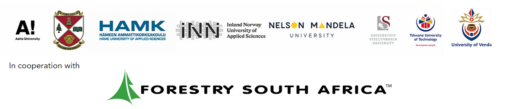

```{r setup, include=FALSE}
knitr::opts_chunk$set(echo = FALSE)
options(tinytex.verbose = TRUE)

if(!require(pacman)) install.packages("pacman")

pacman::p_load(assertthat, backports, base64enc, broom, cli, colorspace, crayon, data.table, DBI, digest, dplyr, ellipsis, evaluate, fansi, flextable, float, gdtools, generics, glue, htmltools, httr , kableExtra, knitr, lifecycle, magrittr, munsell, officer, pillar, pkgconfig, purrr, R6, rlang, rmarkdown, rstudioapi, rvest, scales, sessioninfo, stringi, stringr, svglite, systemfonts, tibble, tidyr, tidyselect, utf8, uuid, vctrs, viridisLite, webshot, withr, xfun, xml2, yaml, zip)
```

\subsectionfont{\raggedright}
\subsubsectionfont{\raggedright}

\thispagestyle{empty}

\begin{centering}

\vspace{3cm}

```{r Partner_logos, echo=F, out.width="100%"}

```

\vspace{3cm}

\Large
{\bf FOREST21 - 21st Century Climate-Smart Forestry Education for Livelihood
  and Sustainability in South Africa}
  
\vspace{2cm}

\Large
{\bf Quality Plan}

\vspace{4cm}

\normalsize
\singlespacing

```{r EU_logo, echo=F, out.width="100%"}

```

\vspace{0.5 cm}

Disclaimer:\\
The information in this document is provided "as is."\\
No guarantee or warranty is given that the information is fit for any particular purpose.\\
The content of this document reflects only the authors' view.\\
The European Commission is not responsbile for any use that\\
may be made of the information it contains.\\
The users use the information at their sole risk and liability.

\vspace{1.5 cm}

\end{centering}

\clearpage

\pagenumbering{roman}

# Project and document information {-}

\renewcommand{\baselinestretch}{0.9}\normalsize

```{r PDI, echo = FALSE}
library(flextable)
library(magrittr)

set_flextable_defaults(fonts_ignore=TRUE) 

preamble <- data.frame(Item = c("Project Number", 
                                "Project Acronym", 
                                "Project Title", 
                                "Start Date of Project", 
                                "End Date of Project", 
                                "Call",
                                "Program",
                                "",
                                "Deliverable Type",
                                "Delverable Ref No.",
                                "Due Date",
                                "Actual Submission Date",
                                "Final Revision No.",
                                "Dissemiation Level",
                                "",
                                "Lead Coordinator",
                                "Contact Details",
                                "",
                                "Finanical Coordinator",
                                "Contact Details",
                                "",
                                "Abstract",
                                "Keyword"),
                        Value = c("123", 
                                  "FOREST21", 
                                  "FOREST21 - 21st Century Climate-Smart Forestry Education for Livelihood and Sustainability in South                                           Africa",
                                  "Date", 
                                  "Date", 
                                  "Call for Proposals 2020 - EAC/A02/2019",
                                  "KA2 – Cooperation for innovation and the exchange of good practices – Capacity Building in the field of                                      Higher Education",
                                  "",
                                  "XXXccccc",
                                  "1289727",
                                  "Date",
                                  "Date",
                                  "1.0",
                                  "GUxxx",
                                  "",
                                  "XXXX xxxxx",
                                  "Adress: \n Phone: \n Mail",
                                  "",
                                  "YYYY yyyyyy",
                                  "Adress: \n Phone: \n Mail:",
                                  "",
                                  "This is an abstract that must describe and summarize the project and this document.",
                                  "Forest21, Forest Eduaciton, Forest Training, Problem-Based Learning"))

preamble <- flextable(preamble)

preamble <- height(preamble, height = .3) %>% 
  hrule(rule = "exact", part = "body")  
                       
preamble %>%  
  theme_vanilla() %>% # evt theme_zebra
  width(j=~Item,width=2) %>% 
  width(j=~Value,width=5) %>%
  set_caption("Project and Document Information") 
  
```

\renewcommand{\baselinestretch}{1.0}\normalsize

\clearpage

# Version History {-}

```{r}

verhist <- data.frame(Version = c("0.1"), Status = c("Initial version"))

verhist <- flextable(verhist)

verhist <- height(verhist, height = .3) %>% 
  hrule(rule = "exact", part = "body")  
                       
verhist %>%  
  theme_vanilla() %>% # evt theme_zebra
  width(j=~Version,width=2) %>% 
  width(j=~Status,width=5) %>%
  set_caption("Version History") 


```


\clearpage

\renewcommand{\baselinestretch}{0.6}\normalsize
\setcounter{tocdepth}{3}
\tableofcontents
\renewcommand{\baselinestretch}{1.0}\normalsize

\clearpage

# Executive Summary {-}

\clearpage

\listoffigures
\listoftables

\clearpage

# List of Abbreviations {-}

\clearpage

# Lists of Contributors {-}

\clearpage

\pagenumbering{arabic}

\clearpage

```{r Introduction, child = "Introduction.Rmd"}
```

\clearpage

```{r QMS, child = "QMS.Rmd"}
```

\clearpage

```{r Summary, child = "Summary.Rmd"}
```

\clearpage

# Bibliography
<div id="refs"></div>

\clearpage

```{r Appendix, child = "Appendix.Rmd"}
```

\clearpage

# Session Info {.unnumbered}

```{r echo=FALSE}
sessioninfo::session_info()
```


